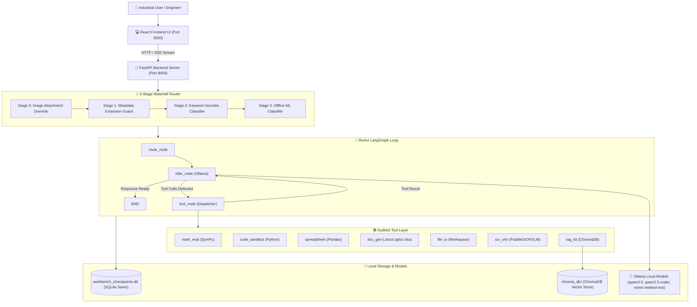

# Sovereign On-Premise Agentic AI Workbench

> **Smart India Hackathon (SIH 2026) — PS 26117**  
> *Sovereign On-Premise Agentic AI Workbench using Open-Weight Multimodal LLMs for Confidential Industrial Operations*  
> **Target Deployments**: Mangalore Refinery and Petrochemicals Limited (MRPL) / PSUs / Defence / Air-Gapped Infrastructures

---

## 🌟 Executive Summary

The **Sovereign On-Premise Agentic AI Workbench** is a 100% air-gapped, confidential AI assistant designed for industrial engineering, refinery management, enterprise document workflows, and data analytics. Running entirely on local hardware (Apple Silicon / NVIDIA GPU) via **Ollama**, it guarantees **zero outbound network data exfiltration** while delivering industrial-grade agentic capabilities.

### Key Highlights
- **100% Air-Gapped Sovereignty**: Zero cloud API dependencies, zero external WAN telemetry. All inference, document extraction, code execution, and vector embeddings run strictly on loopback (`127.0.0.1`).
- **Self-Healing 4-Stage Waterfall Intent Router**: Intelligent prompt classifier routing requests across model roles (`reasoning`, `coding`, `vision`, `ocr`, `embedding`) with local auto-healing against cross-platform `scikit-learn` pickle version mismatches.
- **ReAct LangGraph Orchestrator**: Cyclic ReAct workflow with tool call ID synchronization for Ollama multi-turn tool synthesis, 3-stage tool failure containment, persistent SQLite checkpointers, and loop safety bounds.
- **Confidence-Gated OCR & VLM Fallback**: Layout-aware document transcription using PaddleOCR (PP-Structure) with dynamic fallbacks to Vision-Language Models (VLM).
- **RAG & Enterprise Knowledge Base**: Embedded ChromaDB vector store for on-the-fly ingestion, section-aware chunking, and source-cited retrieval.
- **7 Standalone Audited Tools**: SymPy math solver, Python code execution sandbox, pandas tabular data engine, document deliverable generator (`.docx`, `.pptx`, `.xlsx`), workspace file I/O, OCR/VLM, and RAG search.
- **Minimalist Industrial UI**: Anthropic Claude-inspired interface with dark and light theme palettes, real-time SSE streaming steppers, and enterprise RBAC user controls.

---

## 🏗️ System Architecture



---

## 📁 Repository Directory Structure

```text
agent/
├── README.md                      # Complete System Architecture & Setup Guide
├── server.py                      # FastAPI REST & SSE Streaming API Server
├── phase1_inference.py            # Ollama SDK wrapper, Role Registry & Model Resolution
├── tool_interface.py              # Tool Pydantic schemas, @audited_tool decorator & Path Validator
├── cli.py                         # Interactive Terminal Workbench CLI
├── inspect_run.py                 # Thread Checkpoint History Inspector
├── train_router_classifier.py     # Offline Training script for Stage 3 Router Classifier
├── start_workbench.sh             # Master Startup Script for macOS/Linux
├── stop_workbench.sh              # Service Shutdown Script for macOS/Linux
├── start_workbench.bat            # Windows Command Prompt Startup Script
├── stop_workbench.bat             # Windows Command Prompt Shutdown Script
├── start_workbench.ps1            # Windows PowerShell Startup Script
├── stop_workbench.ps1             # Windows PowerShell Shutdown Script
│
├── router/                        # 4-Stage Waterfall Intent Router Package
│   ├── __init__.py
│   ├── schemas.py                 # FileMetadata & RouteDecision schemas
│   ├── route.py                   # Waterfall Router Entrypoint (Stage 0 Override)
│   ├── metadata_check.py          # Stage 1: Extension-based Routing
│   ├── keyword_check.py           # Stage 2: Intent Keyword Heuristics
│   └── classifier.py              # Stage 3: Offline TF-IDF + Logistic Regression ML Classifier
│
├── orchestrator/                  # ReAct LangGraph Orchestrator Package
│   ├── __init__.py
│   ├── state.py                   # WorkbenchState Pydantic schema
│   └── graph.py                   # StateGraph builder (route -> infer -> tool_node -> infer)
│
├── tools/                         # Audited Agent Tool Layer Package
│   ├── __init__.py                # Tool registry exports
│   ├── registry.py                # TOOL_REGISTRY & JSON Schema Builder
│   ├── math_eval.py               # SymPy Symbolic Math Solver
│   ├── code_sandbox.py            # Isolated Python Execution Jail
│   ├── spreadsheet.py             # Pandas & OpenPyXL Data Engine
│   ├── doc_gen.py                 # Formatted Word/PowerPoint/Excel Generator
│   ├── file_io.py                 # Workspace-Bounded File Operations
│   ├── ocr_vlm.py                 # Confidence-Gated OCR & VLM Fallback
│   ├── rag_kb.py                  # ChromaDB Knowledge Base & Vector Search
│   └── rbac.py                    # SQLite User Auth & Admin Telemetry
│
├── frontend/                      # React + Vite Minimalist Dark-Mode Frontend UI
│   ├── src/
│   │   ├── App.jsx                # Main Application Shell & State Handler
│   │   ├── components/
│   │   │   ├── ChatWindow.jsx     # Centered Chat View & SSE Message Handler
│   │   │   ├── AgenticWorkflowStepper.jsx # Real-Time Workflow Stepper
│   │   │   ├── Sidebar.jsx        # Conversation History & Controls
│   │   │   ├── StatusStrip.jsx    # Ephemeral Execution Status Strip
│   │   │   ├── AdminPanelModal.jsx # Admin RBAC & Audit Metrics
│   │   │   └── LoginScreen.jsx    # Enterprise Authentication Modal
│   └── vite.config.js             # Vite Dev Server Config (Port 3000)
│
└── tests/                         # Comprehensive Master Test Suite Package
    ├── run_all.py                 # Master Test Suite Runner (Phases 1 - 8)
    ├── test_router.py             # Router unit tests
    ├── test_tools.py              # Tool layer unit tests
    ├── test_orchestrator.py       # LangGraph loop unit tests
    ├── test_phase6.py             # ReAct state persistence tests
    ├── test_phase7.py             # OCR & VLM pipeline tests
    └── test_phase8.py             # RAG Knowledge Base tests
```

---

## ⚡ Quickstart & Local Setup

### 1. Prerequisites
- **OS**: macOS / Linux / Windows 10 or 11
- **Python**: 3.10 or higher
- **Node.js**: v18 or higher (with `npm`)
- **Ollama**: Installed and running locally (`http://127.0.0.1:11434`)

### 2. Pull Local Open-Weight LLM Models
```bash
# Reasoning & Vision Model
ollama pull qwen3.5:4b-q4_K_M

# Coding Sandbox Model
ollama pull qwen2.5-coder:3b

# RAG Embedding Model
ollama pull nomic-embed-text
```

### 3. Install Python Dependencies
```bash
pip install pydantic sympy pandas openpyxl python-docx python-pptx opencv-python scikit-learn ollama langgraph langgraph-checkpoint-sqlite paddleocr paddlex pypdfium2 chromadb langchain-text-splitters uvicorn fastapi sse-starlette PyJWT
```

### 4. Install Frontend Dependencies
```bash
cd frontend
npm install
cd ..
```

---

## 🚀 Launching the Workbench

### macOS & Linux
To launch Ollama, the FastAPI backend server, and the React frontend UI automatically:
```bash
./start_workbench.sh
```
To stop all services:
```bash
./stop_workbench.sh
```

### Windows (Command Prompt / PowerShell)
**Using Command Prompt (CMD):**
```cmd
start_workbench.bat
```
To stop all services:
```cmd
stop_workbench.bat
```

**Using PowerShell:**
```powershell
.\start_workbench.ps1
```
To stop all services:
```powershell
.\stop_workbench.ps1
```

### Access Points
- **React Web UI**: `http://localhost:3000`
- **FastAPI Backend API**: `http://localhost:8000`
- **FastAPI OpenAPI Docs**: `http://localhost:8000/docs`
- **Ollama Server**: `http://127.0.0.1:11434`

---

## 💻 CLI & Testing Interface

### Interactive CLI Shell
```bash
python cli.py
```

### Single Prompt Execution
```bash
python cli.py "Calculate the roots of 3x^2 - 12x + 9 = 0"
```

### Executing the Master Test Suite (Phases 1 - 8)
```bash
python tests/run_all.py
```

---

## 🛡️ Air-Gap & Security Guarantees

1. **Zero External Data Exfiltration**: All requests stay within `127.0.0.1`.
2. **Workspace Path Traversal Protection**: File operations are strictly locked inside `./workspace/<session_id>/`.
3. **Audited Standalone Tools**: All agent tools are decorated with `@audited_tool`, recording timestamps, durations, and execution status.
4. **Role-Based Access Control (RBAC)**: Integrated SQLite user authentication and audit metrics for industrial enterprise deployment.

---

## 📜 License & SIH Compliance
Built specifically for **Smart India Hackathon (SIH) 2026 — PS 26117**.  
Targeting air-gapped industrial environments at Mangalore Refinery and Petrochemicals Limited (MRPL).

