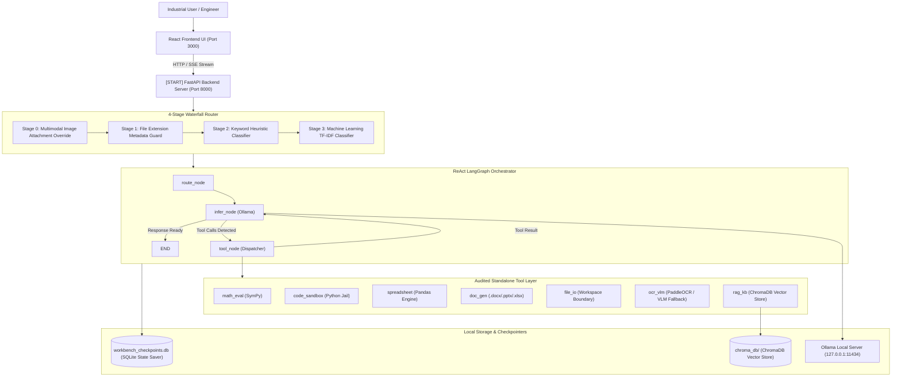
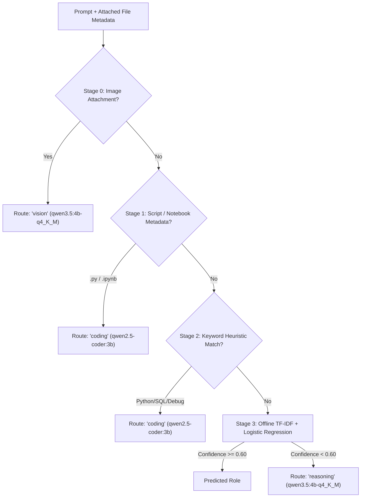

# Sovereign AI Workbench — System Architecture & Topology

> **Smart India Hackathon (SIH 2026) — PS 26117**  
> *Sovereign On-Premise Agentic AI Workbench using Open-Weight Multimodal LLMs for Confidential Industrial Operations*

--- ## Executive Architecture Overview

The **Sovereign On-Premise Agentic AI Workbench** is an enterprise-grade, 100% air-gapped agentic AI system designed for industrial engineering, refinery management, document intelligence, and analytics. Operating entirely on local hardware (Apple Silicon / NVIDIA GPUs) via **Ollama**, it guarantees **zero outbound network data exfiltration** while serving complex multi-turn workflows.



--- ## 4-Stage Waterfall Intent Router

The **Waterfall Intent Router** (`router/route.py`) classifies incoming prompts into specialized model roles (`reasoning`, `coding`, `vision`, `ocr`, `embedding`) to optimize hardware memory and inference latency.



### Waterfall Stages
1. **Stage 0 (Multimodal Override)**: If an image (`.png`, `.jpg`, `.jpeg`, `.webp`) is attached, automatically routes to `vision` role.
2. **Stage 1 (Extension Metadata Guard)**: If a Python script (`.py`) or Jupyter Notebook (`.ipynb`) is attached, routes to `coding` role.
3. **Stage 2 (Keyword Heuristic Classifier)**: Scans for explicit coding keywords (`def `, `import `, `sql`, `exception`, `docker`, `bug`, `refactor`).
4. **Stage 3 (Machine Learning Classifier)**: Uses a TF-IDF vectorizer and Logistic Regression model trained on prompt corpora. Includes **self-healing auto-retraining** if a cross-platform `scikit-learn` version mismatch is detected.

--- ## ReAct LangGraph Orchestrator & State Management

The core decision loop is built using **LangGraph** (`orchestrator/graph.py`) with state checkpointers backed by SQLite (`workbench_checkpoints.db`).

### State Schema (`WorkbenchState`)
```python
class WorkbenchState(BaseModel):
    prompt: str
    file_metadata: Optional[List[FileMetadata]] = None
    messages: List[Dict[str, Any]] = Field(default_factory=list)
    route_decision: Optional[RouteDecision] = None
    tool_calls: List[Dict[str, Any]] = Field(default_factory=list)
    tool_results: List[ToolResult] = Field(default_factory=list)
    tool_iteration_count: int = 0
    max_tool_iterations: int = 5
    thinking: bool = True
    response: Optional[str] = None
```

### Loop Execution
1. **`route_node`**: Executes the waterfall router and attaches workspace context.
2. **`infer_node`**: Invokes Ollama chat inference (`phase1_inference.py`), receiving either direct response text or tool calls. Ensures all tool calls have normalized IDs matching subsequent tool response messages.
3. **`should_continue`**: Conditional edge checking if tool calls exist and `tool_iteration_count < max_tool_iterations`.
4. **`tool_node`**: Dispatches tool calls across 3 failure containment stages (Unknown tool, Invalid args, Execution exception).

--- ## Real-Time SSE Streaming Protocol

The FastAPI server (`server.py`) streams real-time execution telemetry to the React frontend via Server-Sent Events (`text/event-stream`):

| Event Name | Description | Payload Data |
| :--- | :--- | :--- |
| `status` | Ephemeral execution status badge | `{"stage": "routing", "detail": "..."}` |
| `route_decision` | Router output metadata | `{"role": "coding", "confidence": 0.85, "method": "keyword"}` |
| `plan` | Step-by-step workflow plan | `{"steps": ["Execute Python code", "Synthesize response"]}` |
| `tool_call_start` | Tool invocation notification | `{"tool_name": "code_sandbox", "tool_input": {...}}` |
| `tool_call_result` | Tool output summary | `{"tool_name": "code_sandbox", "success": true, "output_summary": "..."}` |
| `token` | Incremental LLM text token chunk | `{"content": "Word "}` |
| `final` | Turn completion summary | `{"content": "Full response", "duration_seconds": 2.4}` |
