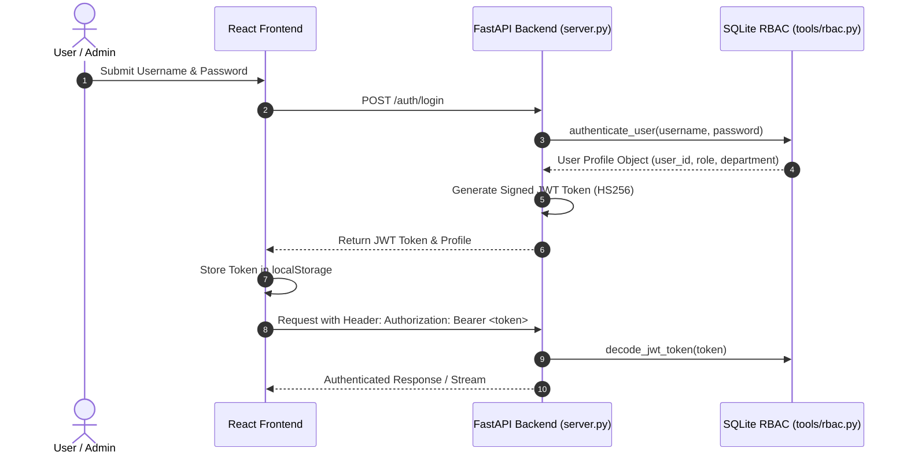

# Sovereign AI Workbench — Authentication & RBAC Security

> **Smart India Hackathon (SIH 2026) — PS 26117**  
> *Role-Based Access Control (RBAC), JWT Authentication & Multi-Tenant Isolation*

--- ## Security Principles & Sovereignty

1. **Strict Air-Gap Guarantee**: Zero external WAN requests. User credentials, authentication hashes, and session tokens are validated locally on `127.0.0.1`.
2. **Multi-Tenant Isolation**: Regular users (`role="user"`) can only access their own conversation threads, workspace files, and historical checkpoints.
3. **Admin Administrative Control**: Admin users (`role="admin"`) have authorization to create new users, delete conversation threads, and view system audit telemetry.

--- ## Authentication Architecture (`tools/rbac.py`)

Authentication is backed by a local SQLite database (`workbench_checkpoints.db`) with tables for `users`, `thread_users`, and `audit_metrics`.

--- ## Default User Accounts & Seed Credentials

Upon initial launch, the system automatically initializes the SQLite RBAC tables with seed accounts:

| Username | Role | Default Password | Department |
| :--- | :--- | :--- | :--- |
| **`engineer1`** | `user` | `engineer123` | Operations |
| **`admin`** | `admin` | `admin123` | Systems & IT |
| **`analyst1`** | `user` | `analyst123` | Data Analytics |

--- ## Admin & User Capabilities

### User Features (`role="user"`)
- Log in securely and receive signed JWT token.
- Change personal account password via Sidebar modal (`POST /auth/change-password`).
- Create new chats and execute multi-turn agent conversations.
- Upload workspace files and download generated deliverables (`.docx`, `.pptx`, `.xlsx`).
- Upload documents to the local RAG knowledge base.

### Admin Features (`role="admin"`)
- All standard user capabilities.
- **Create Users**: Add new user accounts with specified roles and initial passwords via Admin Dashboard modal (`POST /admin/users`).
- **Delete Threads**: Delete conversation threads and purge checkpoint history (`DELETE /threads/{thread_id}`).
- **View All Threads**: Access all user conversations across the organization.
- **System Audit Metrics**: View total users, total conversations, active checkpointer entries, and total file deliverables (`GET /admin/audit_metrics`).

--- ## API Authorization Dependencies (`server.py`)

All FastAPI endpoints enforce JWT bearer token verification:

- `get_current_user`: Decodes bearer token, verifies signature, and attaches user context.
- `require_admin`: Enforces `user["role"] == "admin"`.
- `verify_thread_access(thread_id, current_user)`: Blocks non-admin users from accessing or modifying threads owned by another user.
