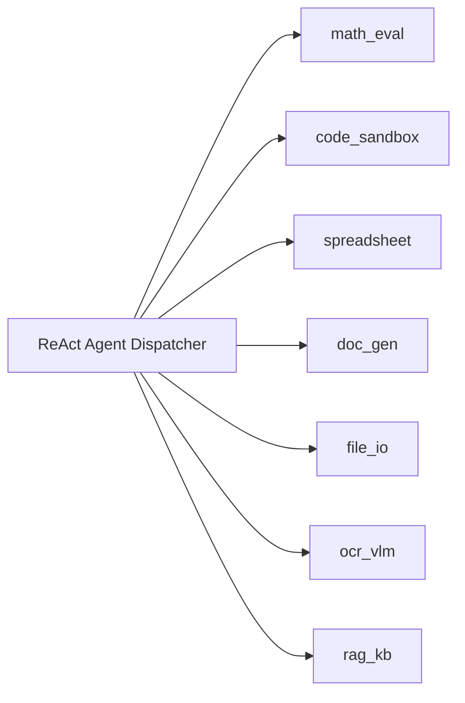
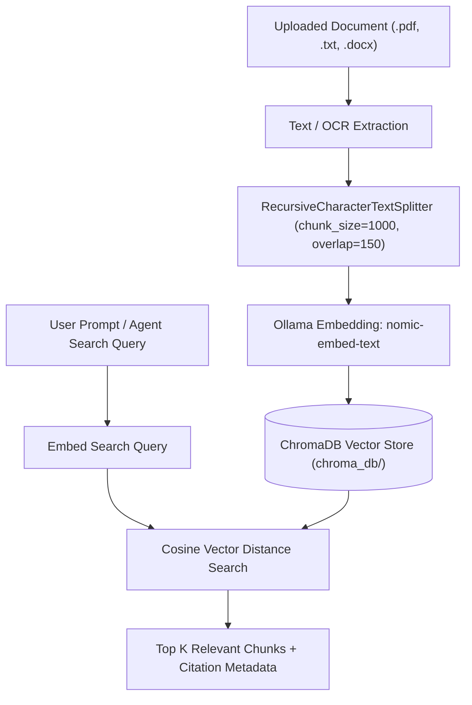

# Sovereign AI Workbench — Audited Tool Layer & RAG Knowledge Base

> **Smart India Hackathon (SIH 2026) — PS 26117**  
> *Standalone Audited Tools, OCR/VLM Pipeline & ChromaDB Vector Store*

--- ## Audited Standalone Tool Registry

Every agent action is wrapped with the `@audited_tool` decorator (`tool_interface.py`), recording execution status (`success`, `partial`, `error`), duration, timestamp, and audit metadata.

### 1. `math_eval` (`tools/math_eval.py`)
- **Engine**: SymPy (Symbolic Mathematics)
- **Capability**: Evaluates algebraic equations, calculus derivatives, integrals, matrix operations, and trigonometric expressions symbolically with exact rational precision.

### 2. `code_sandbox` (`tools/code_sandbox.py`)
- **Engine**: Subprocess Execution Jail (with Docker container fallback)
- **Capability**: Executes untrusted Python code in an isolated workspace container with CPU/memory limits, stdout/stderr capture, plot rendering, and generated file tracking. Uses `sys.executable` for cross-platform compatibility.

### 3. `spreadsheet` (`tools/spreadsheet.py`)
- **Engine**: Pandas & OpenPyXL
- **Capability**: Processes tabular data files (`.csv`, `.xlsx`). Supports data filtering, aggregations, column transformations, missing value cleanup, and pivot calculations.

### 4. `doc_gen` (`tools/doc_gen.py`)
- **Engine**: `python-docx`, `python-pptx`, `openpyxl`
- **Capability**: Generates formatted Word documents (`.docx`), PowerPoint presentations (`.pptx`), and Excel spreadsheets (`.xlsx`) directly into the session workspace directory.

### 5. `file_io` (`tools/file_io.py`)
- **Engine**: Workspace-Bounded File System API
- **Capability**: Read, write, append, and list files inside session workspace boundaries. Enforces strict path traversal (`..`) security guards via `validate_workspace_path`.

### 6. `ocr_vlm` (`tools/ocr_vlm.py`)
- **Engine**: PaddleOCR (PP-Structure) + Vision-Language Model (VLM Fallback)
- **Capability**: Transcribes structured text, table layouts, and headers from scanned documents (`.pdf`, `.png`, `.jpg`).
- **Confidence-Gated Pipeline**:
  - If primary layout confidence >= `0.90`, uses PaddleOCR PP-Structure text transcript.
  - If layout confidence < `0.90` (degraded scan), automatically triggers VLM vision fallback (`qwen2.5-vl:3b`).

### 7. `rag_kb` (`tools/rag_kb.py`)
- **Engine**: ChromaDB Vector Store + `nomic-embed-text`
- **Capability**: On-the-fly document ingestion, section-aware chunking, vector similarity search, document re-ingestion overwrite protection, and disk reference management.

--- ## RAG Knowledge Base Architecture (`tools/rag_kb.py`)

The Knowledge Base enables ground-truth document retrieval for industrial engineering SOPs, refinery manuals, and policy documents.

### Citation Enforcement
When the agent answers a user question using chunks retrieved from `rag_kb`, it is explicitly instructed to cite source filenames (e.g. `[Source: mrpl_hcu_manual.txt]`) in the final markdown deliverable.
